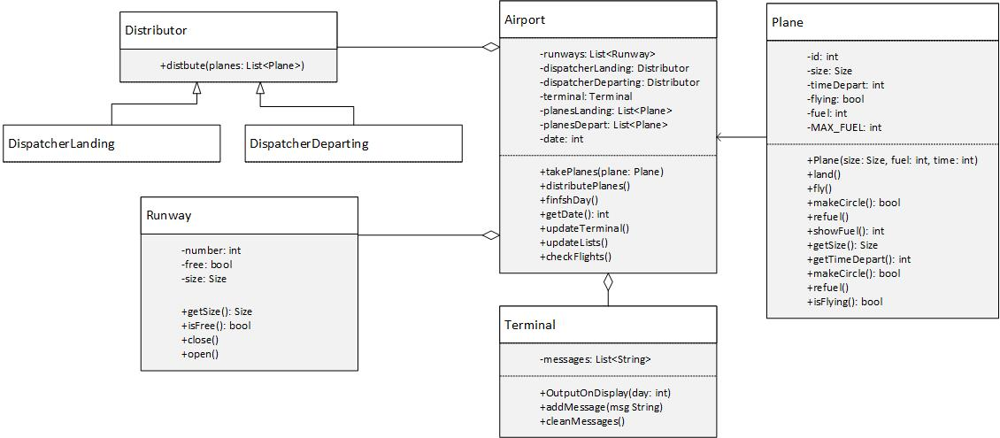

Приложение аэропорт.  
Основная сущность – аэропорт. У аэропорта есть полосы, диспетчеры, очередь самолетов на посадку и очередь на вылет. У аэропорта есть два метода – принять самолеты из генератора и распределить (в течении итерации). Также будет отдельный модуль для вывода – терминал/экран. Enum реализуем разными типами полос (пусть это будет длина), соответственно самолеты тоже будут нескольких видов.  
Время  
Все будет происходить в итерациях. Пусть одна итерация = один день. За один день на полосу может сеть или взлететь один самолет. Также после посадки самолет должен заправиться, это тоже занимает один день. Взлет или посадка это событие, информация о них выводится на табло. Диспетчеров двое, для посадки и для отправление, они наследуются от общего интерфейса, так как распределяют по одной логике, но некоторые действия все же отличаются.
Как сделать механизм расписания.  
Допустим генератор будет знать какой сейчас день (итерация). Тогда он генерирует случайным образом предполагаемый день отбытия самолета. Диспетчер не будет выпускать самолет ранее этого срока (не реализовал). Если же в нужный день самолет не сможет взлететь из-за очереди, на табло должно выйти сообщение о задержке. Отравить самолет в день отправления – высший приоритет.
Отсюда вытекают и оповещения, если самолет не может вылететь в запланированный день, идет сообщение в терминал  
P.S. Вообще сортировка слабая и генератор не настроен, различные ситуации проверил, хоть тесты делай). Но такой цели не было.  
